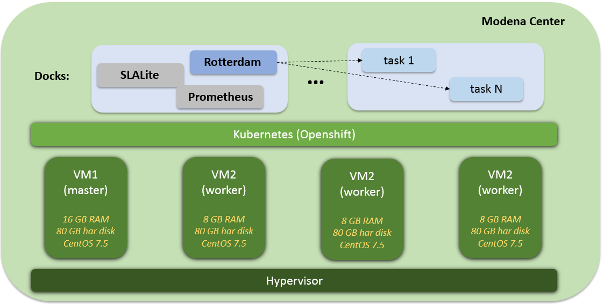

# Kubernetes, Openshift


-----------------------

[Kubernetes](#kubernetes)

[Openshift](#openshift)

-----------------------


## Kubernetes


### Installation


### Configuration

-----------------------


## Openshift

Documentation about how to deploy and configure an Openshift cluster can be found here: [Installing OKD clusters](https://docs.okd.io/latest/install/index.html) It is recommended to read this documentation carefully.

In the [CLASS project](https://class-project.eu/) **Openshift 3.10.0** was deployed in a cluster composed by 4 nodes.

### Installation tips (Openshift 3.10 in CentOS 7.5)



#### Requirements and previous configurations

**Note:** This document needs to be improved and updated. The following instructions are only "help notes".

1. Network and authentication

    The OKD installer requires a user that has access to all hosts. **LINK TO DOCUMENT**: https://docs.okd.io/latest/install/host_preparation.html#ensuring-host-access

    ```bash
    ssh-keygen

    ssh-copy-id -i ~/.ssh/id_rsa.pub kube5
    ssh-copy-id -i ~/.ssh/id_rsa.pub kube6
    ssh-copy-id -i ~/.ssh/id_rsa.pub kube7

    chmod 644 authorized_keys
    ```

    A shared network must exist between the master and node hosts. **LINK TO DOCUMENT**: https://docs.okd.io/latest/install/prerequisites.html#node-hostnames-prereq

    ```bash
    sudo vi /etc/resolv.conf

    # Generated by NetworkManager
    search comune.modena.it
    nameserver 10.0.1.253
    nameserver 10.0.2.253

    dig master.comune.modena.it @10.0.1.253 +short
    dig kube4.comune.modena.it @10.0.1.253 +short
    ```

2. For Openshift version 3.10, **Ansible 2.6.5** is required. Version 2.7 fails.

    ```bash
    curl "https://bootstrap.pypa.io/get-pip.py" -o "get-pip.py"
    python get-pip.py
    sudo pip install ansible==2.6.5
    ```

3. Installing base packages (in each node / host)

    **LINK TO DOCUMENT**: https://docs.okd.io/latest/install/host_preparation.html#installing-base-packages

    ```bash
    sudo yum install docker-1.13.1
    sudo rpm -V docker-1.13.1
    sudo docker version


    sudo yum install atomic
    sudo atomic host upgrade


    sudo yum update
    ```

4. Configuring Docker Storage (x node)

    Containers and the images they are created from are stored in Docker’s storage back end. This storage is ephemeral and separate from any persistent storage allocated to meet the needs of your applications. With Ephemeral storage, container-saved data is lost when the container is removed. With persistent storage, container-saved data remains if the container is removed.

    You must configure storage for all master and node hosts because by default each system runs a container daemon. **LINK TO DOCUMENT**: https://docs.okd.io/latest/install/host_preparation.html#configuring-docker-storage

    Volume GROUPS

    ```bash
  	sudo lsblk

  	sudo umount /opt

  	sudo vgcreate vgroup1 /dev/sdc1

  	sudo vgdisplay


    sudo vi /etc/sysconfig/docker-storage-setup
  	-----------------------
  	#DEVS=/dev/sdc1
  	VG=vgroup1
  	-----------------------
    ```

    Edit and delete content from '/etc/sysconfig/docker-storage'

    ```bash
    sudo vi /etc/sysconfig/docker-storage

    DOCKER_STORAGE_OPTIONS="--storage-driver overlay2 "

    sudo docker-storage-setup
    ```

5. 'SELinux Requirements' (for each node)

    **LINK TO DOCUMENT**: https://docs.okd.io/latest/install/prerequisites.html#prereq-selinux

    Security-Enhanced Linux (SELinux) must be enabled on all of the servers before installing OKD or the installer will fail.
    Also, configure SELINUX=enforcing and SELINUXTYPE=targeted in the '/etc/selinux/config' file:

    ```bash
    # This file controls the state of SELinux on the system.
    # SELINUX= can take one of these three values:
    #     enforcing - SELinux security policy is enforced.
    #     permissive - SELinux prints warnings instead of enforcing.
    #     disabled - No SELinux policy is loaded.
    SELINUX=enforcing
    # SELINUXTYPE= can take one of these three values:
    #     targeted - Targeted processes are protected,
    #     minimum - Modification of targeted policy. Only selected processes are protected.
    #     mls - Multi Level Security protection.
    SELINUXTYPE=targeted
    ```

    ==> restart

    ==> problems with ssh login? password prompt?

    ```bash
    sudo sealert -a /var/log/audit/audit.log
    sudo semanage fcontext -a -t user_home_dir_t '/m/home'
    sudo restorecon -v '/m/home'

    sudo semanage fcontext -a -t ssh_home_t '/m/home/rsucasas/.ssh/authorized_keys'
    sudo restorecon -v '/m/home/rsucasas/.ssh/authorized_keys'

    semanage fcontext -a -t ssh_home_t 'authorized_keys'


    sudo vi /etc/ssh/sshd_config


    PubkeyAuthentication yes
    RSAAuthentication yes


    sudo semanage boolean -l


    sudo setsebool -P ssh_chroot_rw_homedirs on
    sudo setsebool -P ssh_keysign on
    sudo setsebool -P fenced_can_ssh on
    sudo setsebool -P selinuxuser_use_ssh_chroot on
    sudo setsebool -P ssh_sysadm_login on
    ```

### Configuration


-----------------------
