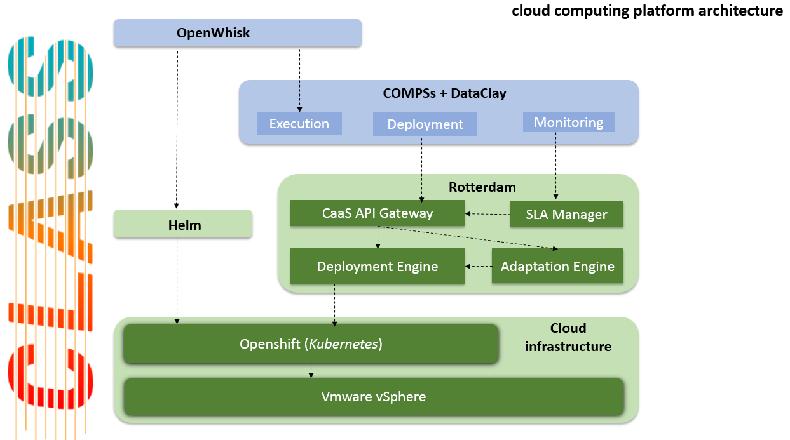

# ROTTERDAM CAAS

&copy; Atos Spain S.A. 2018

[](https://www.apache.org/licenses/LICENSE-2.0.html)
[]()


-----------------------

[Description](#description)

[Installation Guide](#installation-guide)

[Docker image](#docker-image)

[Usage Guide](#usage-guide)

[Relation to other components](#porject-class:-relation-to-other-components)

[LICENSE](#license)

-----------------------

### Description

**Rotterdam** is a native-cloud Infrastructure-as-a-Service (IaaS) facade which facilitates the deployment and life cycle management of containerized tasks on container orchestration platforms. Its main purpose is to upload, organize, run, manage and stop sets of containers (named tasks) through API calls, and abstract all the resource infrastructure details, even the concept of cluster of machines/instances, to micro-service developers (in the case of CLASS, data analytics application/service developers).



The Rotterdam's CaaS API application is a Golang component, responsible for the deployment of these tasks in a Kubernetes cluster.

A docker image can be downloaded from https://cloud.docker.com/u/atosclass/repository/docker/atosclass/rotterdam-caas.

-----------------------

### Installation Guide

#### Requirements

- Docker (https://docs.docker.com/install/)
- Kubernetes (https://kubernetes.io/docs/setup/) or Openshift-OKD (https://docs.okd.io/latest/install/index.html)

#### Installation

- You can download the repository and create the docker image:

    ```bash
    sudo docker build -t rotterdam .
    sudo docker run -p 8333:8333 rotterdam
    ```

- You can also run **Rotterdam** in Docker by pulling the image from Docker Hub:

    ```bash
    docker pull atosclass/rotterdam-caas:tagname
    docker run [OPTIONS] atosclass/rotterdam-caas:tagname [COMMAND] [ARG...]
    ```

- Finally, to run **Rotterdam** in Openshift, deploy the [image](https://cloud.docker.com/u/atosclass/repository/docker/atosclass/rotterdam-caas) from Docker Hub using the OKD UI. The following environment variables can be defined:

    - **Mode** "Openshift" or "Kubernetes"
    - **KubernetesEndPoint** "http://192.168.7.28:8001"
    - **OpenshiftEndPoint** "https://192.168.7.28:8443"
    - **ServerIP** "192.168.7.28"
    - **OpenshiftOauthToken** "eyJhbGciOiJSUzI1 ... 3MiOiJrdWJlcm5ldGVzL3Nlc"
    - **SLALiteEndPoint** "http://rotterdam-slalite.192.168.7.28.xip.io"
    - **ServerPort** 8333

    The **Mode** variable defines which orchestrator Rotterdam will use. It can be Kubernetes or Openshift. In the case _Openshift_ is selected, you also have to define the **OauthToken**.

    The **SLALiteEndPoint** is used to automatically generate SLAs and to stop or terminate them. The SLALite component should also point to Rotterdam to send it the violations.

    1. In OKD Web UI, go to selected project / namespace, i.e. the _default_ namespace, and select `Add to project > Deploy Image`
    2. Select `Image Name`
        - `atosclass/slalite:tagname`
          - Name: `rotterdam-slaliteXXX`
          - Environment Variables: `UrlPrometheus`, `UrlRotterdam`, `MetricsPrometheus`
        - `atosclass/rotterdam`
          - Name: `rotterdam-caasXXX`
          - Environment Variables: `OpenshiftOauthToken`
    3. Deploy
    4. Go to new application / deplopyment and select `Create Route`
        - SLALite - Hostname: `rotterdam-slalite.192.168.7.28.xip.io`
        - Rotterdam - Hostname: `rotterdam-cass.192.168.7.28.xip.io`

##### Configuration file

```json
{
    "CaaSVersion": "1.2.1",
    "RulesEngineVersion": "0.0.2",
    "RestApiVersion": "1.0.7",
    "SLALiteVersion": "0.6.4",
    "ServerPort": 8333,
    "Clusters": [{
        "Id": "cluster01",
        "Name": "Default",
        "Description": "Default cluster",
        "Mode": "Openshift",
        "KubernetesEndPoint": "http://192.168.7.28:8001",
        "OpenshiftEndPoint": "https://192.168.7.28:8443",
        "ServerIP": "192.168.7.28",
        "OpenshiftOauthToken": "eyJhbGciOiJS....ftiuExZEUBMCq2LPZFd-CpDZvrQG9eDD2l1EDp37bHwOrZ5VeNboaV7Iw",
        "SLALiteEndPoint": "http://rotterdam-slalite.192.168.7.28.xip.io"
    }],
    "SLAs": {
        "SupportedQoSMetrics": ["go_memstats_frees_total"],
        "CreationDate": "2019-01-01T00:00:00Z",
        "ExpirationDate": "2024-01-01T00:00:00Z"
    }
}
```

##### Dockerfile

```bash
##########################################
FROM golang:alpine as builder

RUN apk add --no-cache git curl

RUN curl https://raw.githubusercontent.com/golang/dep/master/install.sh | sh

WORKDIR /go/src/atos/rotterdam

COPY . .

RUN go get -d -v ./...
RUN CGO_ENABLED=0 GOOS=linux go build -a -o Rotterdam .

##########################################
FROM alpine:3.6
WORKDIR /opt/rotterdam

COPY --from=builder /go/src/atos/rotterdam/Rotterdam .
COPY run_rotterdam.sh run_rotterdam.sh
COPY ./config/config.json ./config/config.json
COPY ./rest-api ./rest-api

RUN chmod 775 /opt/rotterdam/run_rotterdam.sh

EXPOSE 8333
ENTRYPOINT ["/opt/rotterdam/run_rotterdam.sh"]
```

-----------------------

### Usage Guide

Once **Rotterdam** is deployed, you can access it through the REST API UI provided by _swagger_: (i.e.) http://rotterdam-caas.192.168.7.28.xip.io/swaggerui/

The following methods have been defined:

- To get information about Rotterdam or the selected orchestrator
  - **GET** /api/v1/config
  - **GET** /api/v1/version
  - **GET** /api/v1/status
  - **GET** /api/v1/caas/config
  - **GET** /api/v1/rules-engine/config
- The following method is used by the **SLALite** component to send Rotterdam violations and notifications
  - **POST** /api/v1/sla/tasks/{name}/guarantee/{guarantee}
- To get all running tasks
  - **GET** /api/v1/docks/tasks
- To create a new tasks in Rotterdam
  - **POST** /api/v1/docks/tasks
  - **POST** /api/v1/docks/tasks-compss
- To view / manage tasks
  - **GET** /api/v1/docks/{dock}/tasks
  - **GET** /api/v1/docks/{dock}/tasks/{name}
  - **PUT** /api/v1/docks/{dock}/tasks/{name}
  - **DELETE** /api/v1/docks/{dock}/tasks/{name}
  - **GET** /api/v1/docks/{dock}/tasks/{name}/containers

#### Task definition example

```json
{
    "name": "adas-my-nginx",
    "dock": "default",
    "qos": {
      "name": "custom",
      "description": "custom qos",
      "custom": [{
          "guarantees": [{"metric": "metric_name", "condition": ">", "value": "15"}],
          "action": "scale_up",
          "scalefactor": 2,
          "max": 10,
          "min": 1,
          "type": "infr / task",
          "name": "custom1",
          "description": "custom1 qos"
      }]
    },
    "replicas": 10,
    "containers": [{
      "name": "adas-my-nginx-app",
      "image": "nginx",
      "ports": [
          {
            "containerPort": "80",
            "hostPort": "80",
            "protocol": "tcp"
          }
        ],
      "volumes": [
        {
          "name": "PATH",
          "mounthPath": "/usr/share/class/vol/"
        }],
			"environment": [
				{
					"name": "TEST_VAL",
					"value":"1.2.3"
				}
			]}
    ]
}
```


#### Predefined QoS

| QoS                         | description | description                                       | source, job       |
|-----------------------------|-------------|---------------------------------------------------|-------------------|
| **KubeletTooManyPods**      | infra       | scale down task if total of cluster pods is > 50  | Prometheus - kubernetes-nodes-cadvisor |
| **KubeletPodsLessThan100**  | infra       | scale down task if total of cluster pods is > 100 | Prometheus - kubernetes-nodes-cadvisor |
| **KubeletPodsMoreThan100**  | infra       | scale up task if total of cluster pods is < 100   | Prometheus - kubernetes-nodes-cadvisor |
| **Test_Prometheus_01**      | infra       | force a task to be scaled up                      | Prometheus - kubernetes-nodes-cadvisor |

1. `KubeletTooManyPods`:

    ```json
    {
        "qos": {
          "name": "KubeletTooManyPods",
          "description": "scale down task if cluster pods > 50"
        }
    }
    ```

    _KubeletTooManyPods_ QoS is equivalent to the following:

    ```json
    "custom": [{
        "guarantees": [{"metric": "kubelet_running_pod_count", "condition": "<", "value": "50"}],
        "action": "scale_down",
        "scalefactor": 2,
        "max": 30,
        "min": 1,
        "type": "infr",
        "name": "cluster_pods_less_50",
        "description": "scale down task if cluster pods > 50"
    }]
    ```

2. `Test01`:

    ```json
    {
        "qos": {
          "name": "Test_Prometheus_01",
          "description": "scale up task if go_memstats_frees_total metric is less than 500000"
        }
    }
    ```

#### Supported QoS metrics

| Metric                          | description |
|---------------------------------|-------------|
| **kubelet_running_pod_count**   | Total number of pods running in each node |
| **go_memstats_frees_total**     | Total number of frees in each node |

-----------------------

### Relation to other components


-----------------------

### LICENSE

Libraries used in this project:

| library                         | license | url                                   | description |
|---------------------------------|---------|---------------------------------------|-------------|
| github.com/tidwall/buntdb | MIT | https://github.com/tidwall/buntdb | BuntDB is a low-level, in-memory, key/value store in pure Go |
| github.com/nikunjy/rules/parser | MIT | https://github.com/nikunjy/rules | Rules engine written in golang with the help of antlr |


`Rotterdam` is licensed under [Apache License, version 2](LICENSE.TXT).
